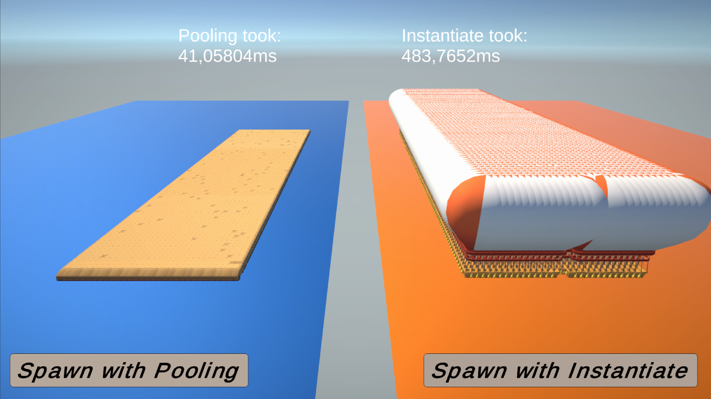

# Unity-ObjectPooling

Object pooling is a design pattern for optimizing games. It is basically a C# Stack from Sytems.Collections. It allows, storing many Game Objects that are ready to use in the game. 

As you can see, using stack reduced the spawn time from 484 ms to 41 ms and this isn’t the only advantage of using object pooling. You can reuse the prefab that you already used by adding the prefab back to the pool again. 

You can find a pooling example in “Scripts/Stack.cs”

